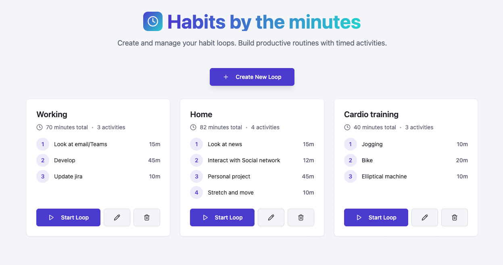

# Habits by the minutes




## Setup

The application use [Tauri](https://tauri.app/) to enable packaging the application, but when running in local, you also can run it with a Web browser.

Using [Bun](https://bun.com/):

```bash
bun run dev
```
or with Tauri:

```bash
bun run tauri dev
```


## Recommended IDE Setup

- [VS Code](https://code.visualstudio.com/) + [Tauri](https://marketplace.visualstudio.com/items?itemName=tauri-apps.tauri-vscode) + [rust-analyzer](https://marketplace.visualstudio.com/items?itemName=rust-lang.rust-analyzer)
